# Innovation Challenge: Building a Virtual Dashboard
&nbsp;
## EVOLOCITY Build Camp
 

---

#### Innovation Challenge
### A Virtual Dashboard for your EV

- Provide performance feedback to the user(s)
  - Battery status and drive power 
  - Speed, distance and acceleration
  - Temprature, indicators, etc.

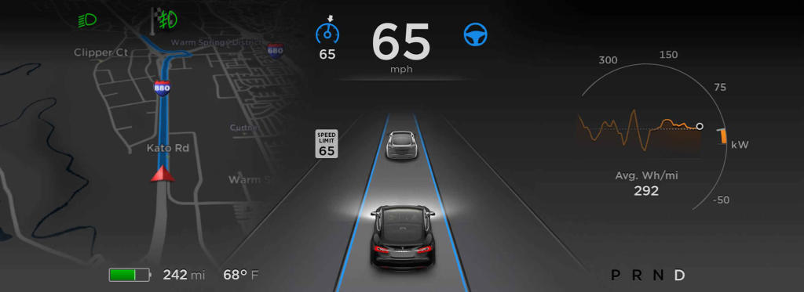

---

# Virtual Dashboard

---

#### Sensors for Measuring Vehicle Performance
### Battery Status and Drive Power

- Can calculate from battery voltage and current 
  - Voltage measured using voltage divider or sensor
  - Current measured using current sensor ICs or resistors

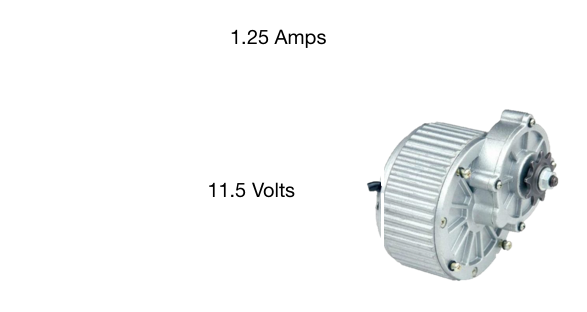

---

#### Sensors for Measuring Vehicle Performance
### Voltage Sensor using a Divider

- Resistor divider steps-down battery voltage
  - Usually to be below 5V
  - E.g. Stepping down 24V battery to 2.8V-2.0V

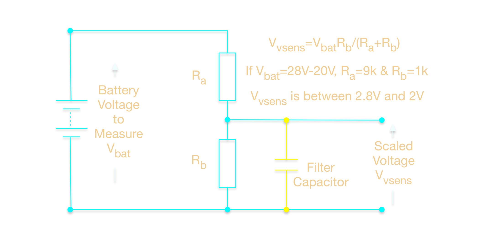

---

#### Sensors for Measuring Vehicle Performance
### Current Sensor using a Shunt

- Shunt resistor converts current to voltage
  - Need amplification to minimise power loss
  - E.g. Measuring 20A with a 2mΩ shunt

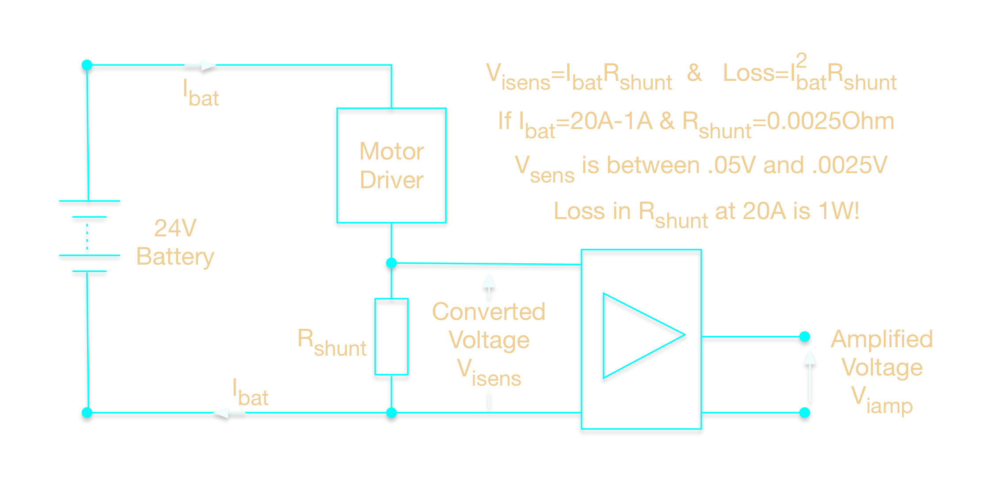

________
#### Sensors for Measuring Vehicle Performance
### Vehicle Speed and Acceleration

- Can use GPS, tachometer, or feedback from motor
  - Tachometers use optical/magnetic sensor on wheel
  - GPS triangulate satellite signals to infer location

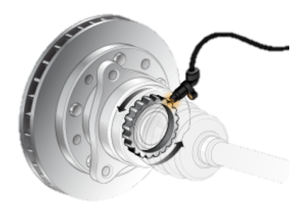

________
#### How to Use an Optical Tachometer
### Photo Interrupter Tachometer

- Uses a light emiting diode (LED) and a light detector
  - Cheap and very easy to use
  - Also called a shaft/rotary encoder

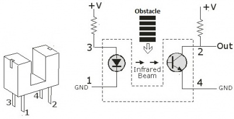

________
#### How to Use an Optical Tachometer
### Powering the Photo Interrupter

- LED needs to be turned on by supplying power
  - Can use 5V supply with a current limiting resistor
  - Light detector may need power/measurement resistor

________
#### How to Use an Optical Tachometer
### How the Tachometer Works

- If light reaches the detector, it outputs a signal
    - When the light is blocked, no signal
- A slotted disk attached to wheel blocks/unblocks light
    - Produces a pulse signal indicative of wheel speed

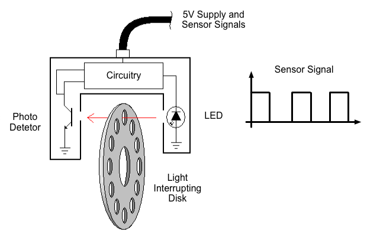

________
## Tachometer Demonstration
### Observe the photo detector waveforms on an oscilloscope

--------
# Building a Circuit Prototype for Testing

--------   
#### Using a Breadboard
### Why do We Use Breadboards?

- Used to quickly assemble and test electronic circuits
  - Holes are electrically connected with other holes
  - Component legs inserted into holes make a circuit

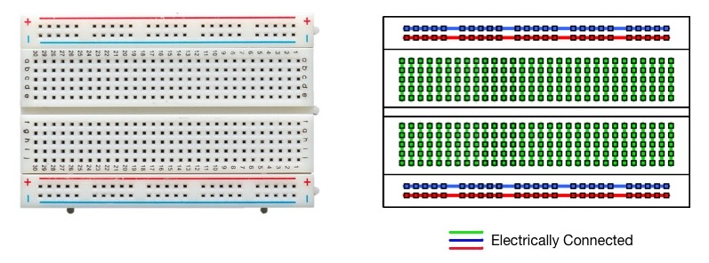

________    
#### Using a Breadboard
### A Simple LED Circuit with On/Off Switch

- Assemble a push-button and an LED on the breadboard 
  - Switch is closed when pressed, open when released
  - Connect LED to the push-button through a resistor

________
## Breadboard Demonstration
### Build and test the LED ciruit

--------
# System Implementation

--------
#### Recommended Implementation
### Picture Diagram 

________
#### Recomended Implementation
### System Diagram

- Complex systems divided into more manageable portions
  - Each smaller portion shown as a block/box
  - Connected boxes show the complete system
- Draw a simple system diagram for your design
  - VI sensor and photo interrupter blocks provide inputs
  - Motor control and warning light can be outputs

________
#### Recomended Implementation
### An Example System Diagram

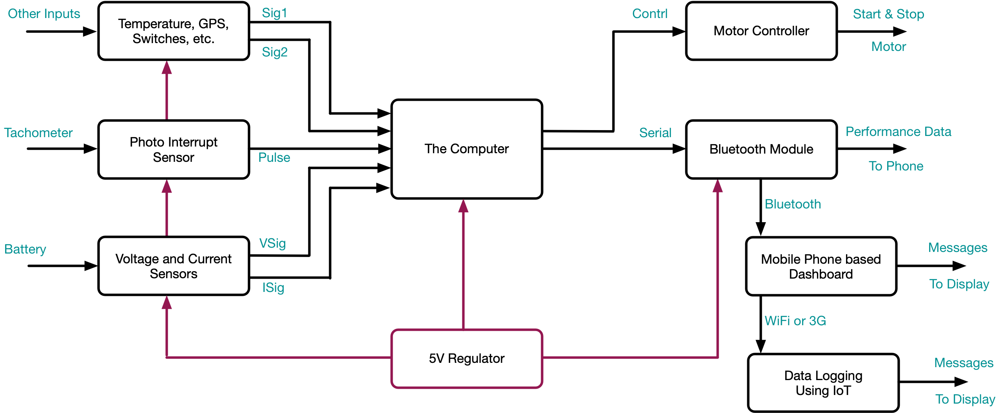
  
--------
#### The Brain
### What Does the Brain Do?

- Need to collect data about the environment (sense)
- Need to make decisions based on data (process)
- Need to take actions based on decisions (actuate)

Inputs -> Processing -> Outputs

________
#### The Brain
### How Do We Build a Brain?

- Can be implemented using
  - Mechanical equipment
  - Analogue electronics
  - Logic elements
  - Computers (most common choice)

--------
# Computers

--------
### What is a Computer?
An electronic device that can   *receive, process, and store data*

________
#### Early Computers
### The ENIAC

- Electronic Numerical Integrator and Computer (1946)
  - Programmed with punch cards
  - 0.3 seconds per addition, 6 seconds for multiplication
  - Broke down about once a week

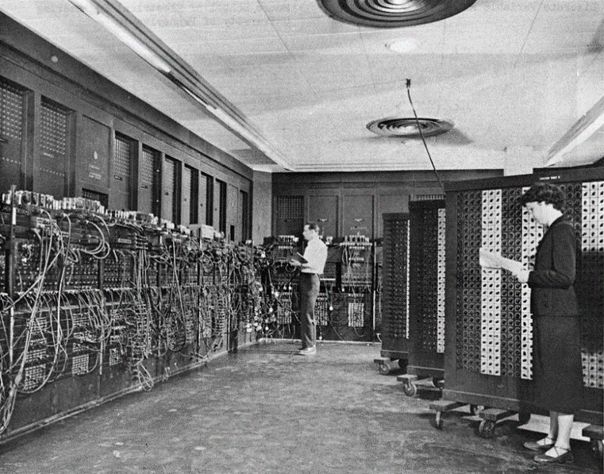

________
#### Modern Day Computers
### Supercomputers

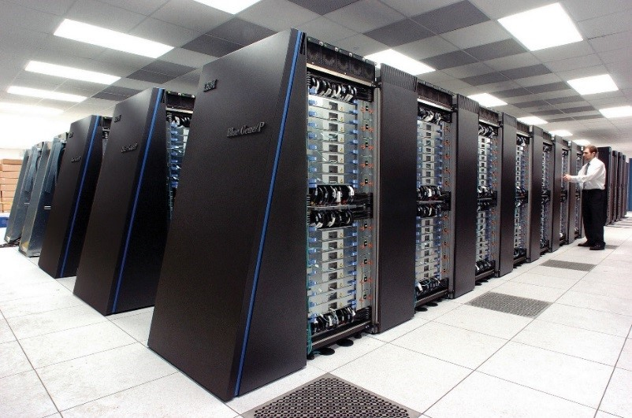

________
#### Modern Day Computers
### Servers

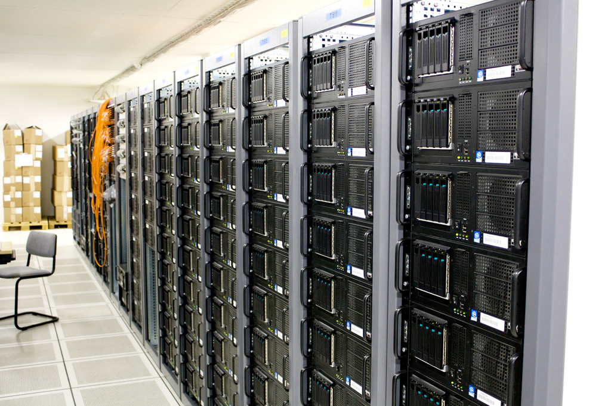

________
#### Modern Day Computers
### Desktop and Laptop Computers

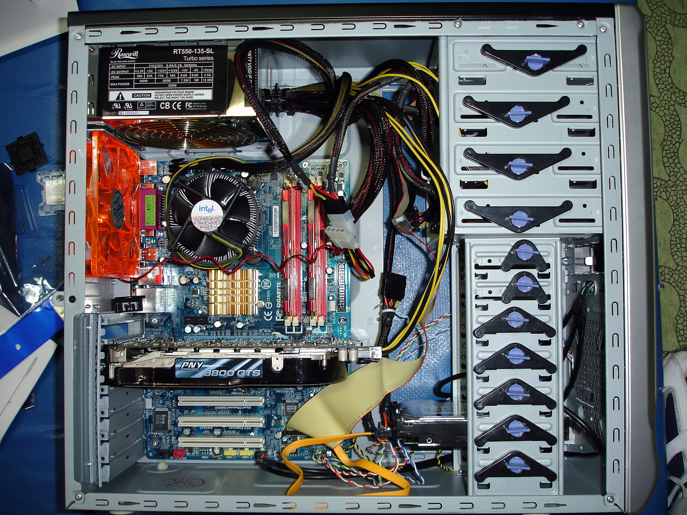

________
#### Modern Day Computers
### Mobile Computers

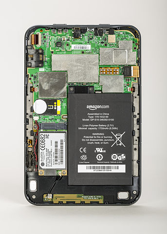

________
#### Modern Day Computers
### Embeded Computers 

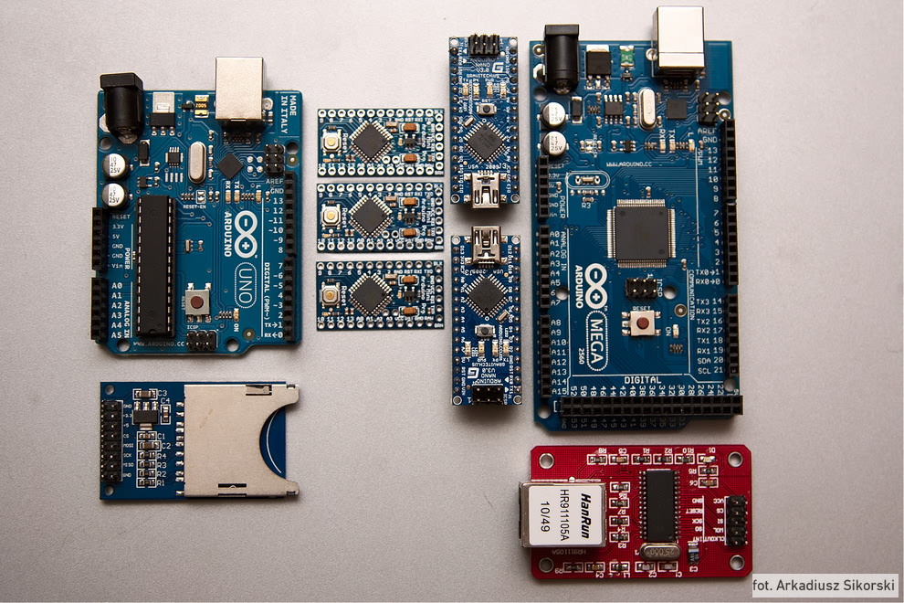

--------
### Which Computer Should We Use?

- A microcontroller can be 'The Brain' of your system
  - An _embeded_ computer
  - Low power consumption
  - Sufficient processing power
  - Useful in-built peripherals
  - Cheap and easy to use
  
________
### Microcontrollers

In addition to the processor, they have   *in-built memory and peripherals*

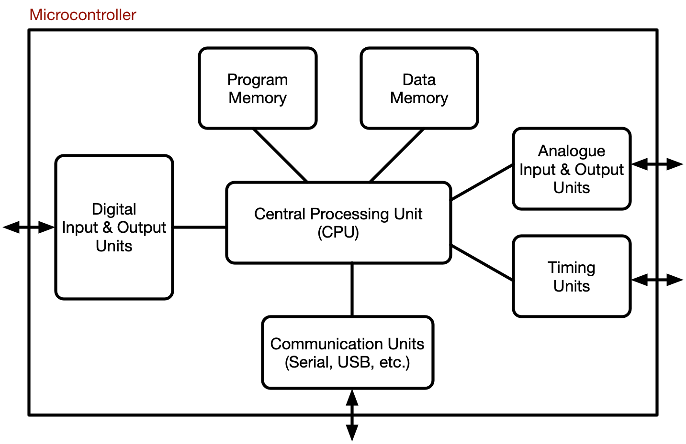

--------
#### Programming
### How do we make computers think?

- Use *variables* and *conditionals* to implement *algorithms*
  - Organise into *functions* for our sanity
- Instructions are written in programming languages
  - Compilers convert the program to machine code 
- Machine code is loaded to the microcontroller
  - Using programming hardware (a cable and a chip)

________
#### Programming
### Variables, Conditionals and Loops

- A variable is used to store data
  - Using correct types like *int* and *char* is important
- Conditionals are used to make decisions 
  - Statements like *if* and *else* are used
  - Logical operators used to compare variables
- Loops are used to repeat a set of instructions
  - *for* and *while* loops are commonly used
  
________
#### Programming
### The C Language

- Low level programming language
  - Created in 1969
  - Pretty unforgiving (but better than assembly!)

________
#### Programming
### Arduino IDE

- A simplified integrated development environment (IDE)
  - Built for microcontrollers, specifically ATMega chips
  - An Arduino program is called a *sketch*
- Provides many useful libraries to simplify programing
  - Easy use of peripherals and shields
  - Many examples and abundant support forums
  - Can use with C or C++ 

--------
### Xplained Mini 328P

- The hardware platform used during this workshop
- Supports Arduino and has
  - An 8-bit microcontroller (ATMega328P) made by Atmel
  - A USB programmer (and a debugger)
  - Easy access to digital and analogue pins  
  - Cheap (~$15) from [Digi-Key](https://www.digikey.com/product-detail/en/microchip-technology/ATMEGA328P-XMINI/ATMEGA328P-XMINI-ND/4890570), [RS](http://nz.rs-online.com/web/p/processor-microcontroller-development-kits/1306148/?origin=PSF_431027|alt), [Element14](http://nz.element14.com/atmel/atmega328pb-xmini/evaluation-board-microcontroller/dp/2522816)
 
--------
# Using Arduino IDE

--------
#### Arduino IDE
### Development Environment

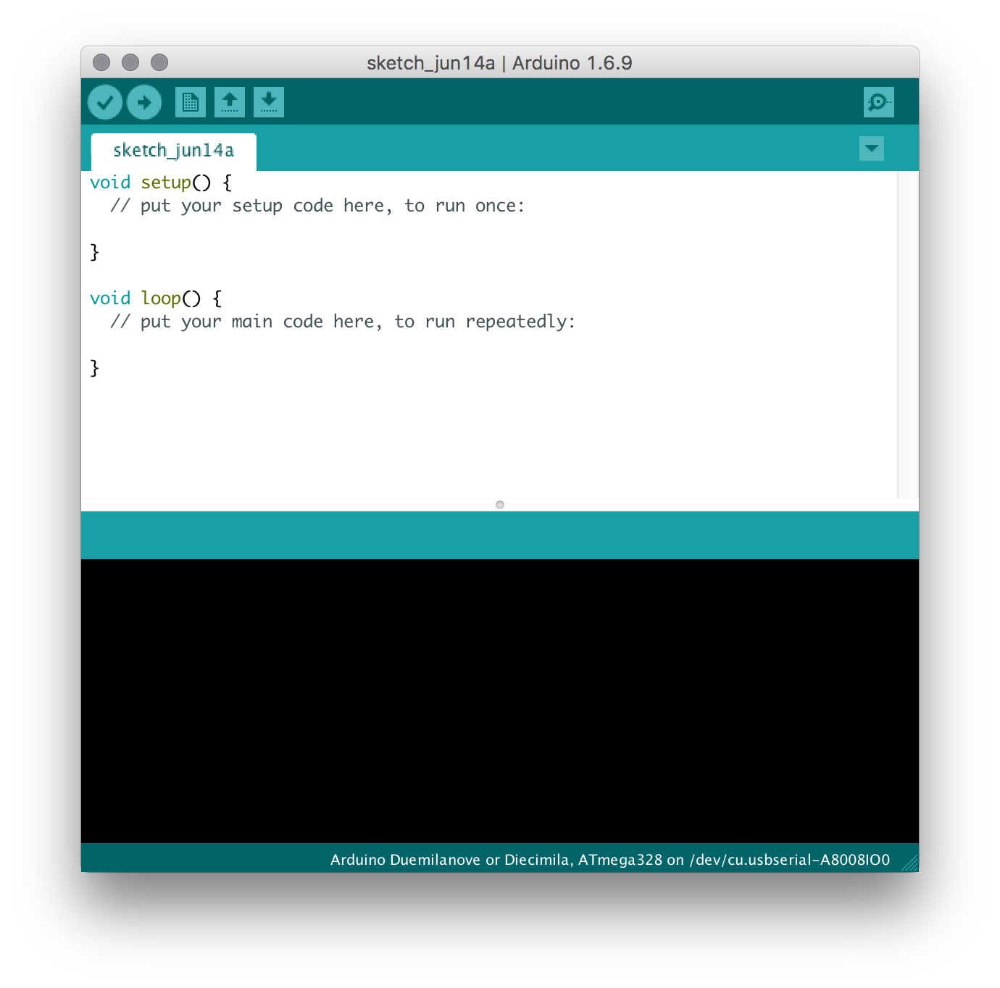

________
#### Arduino IDE
### Compiling and Programming 

- Connect the Xplained mini to the PC
- Open *Blink* example, compile, and upload (program)
  - Change the blink rate, compile, and re-program

________
#### Arduino IDE
### *Blink* Example

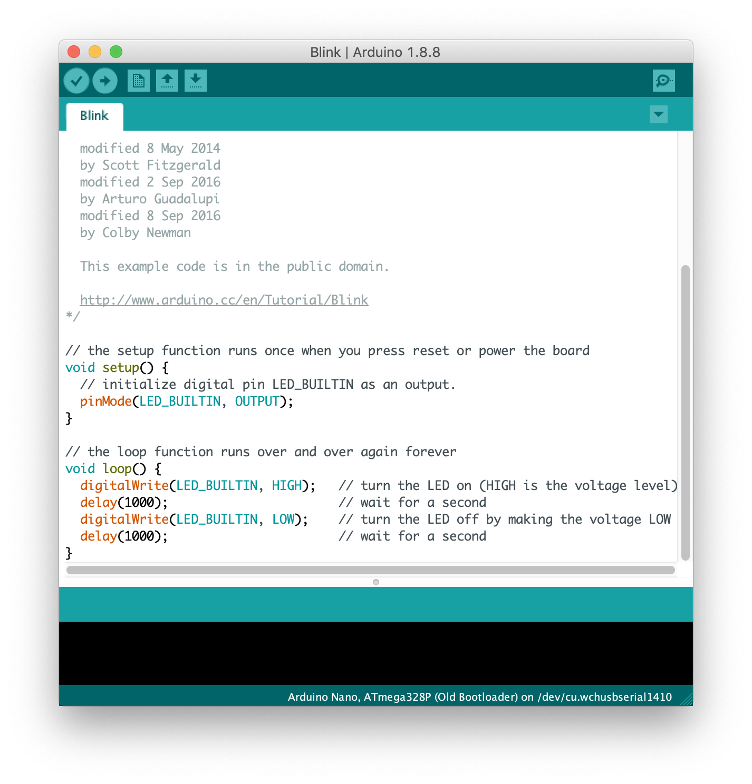

________
#### Arduino IDE
### Programming
<video width="70%" height="70%" controls>
  <source src="img/programming.mp4" type="video/mp4">
Your browser does not support the video tag.
</video>

--------
#### Blinking LED Example
### Turn an LED On and Off

- Supplying 5V through a resistor to an LED turns it on
  - Removing the supply turns it off
- Like the breadboard example, a switch can be used 
  - Connects/diconnects the supply to LED
- Can we use a microcontroller to automate this?

________
#### Blinking LED Example
### Using a Digital Pin as a Switch

- Connect an LED through a resistor to digital pin 11
- A digital pin can be set to produce a logic high output 
  - Behaves like a turned-on switch and supplies 5V
- A digital pin can be set to produce a logic low output 
  - Behaves like turned-off switch and supplies 0V

________
#### Blinking LED Example
### Setup the Digital Pin as a Switch

- Tell program to 'setup' an output pin (behave like a switch)
  - Pin 11 can now produce 5V (logic high) or 0V (logic low)
- We could also 'setup' a digital pin to read digital inputs
  - We will look at an example later

________
#### Blinking LED Example
### Looping while Toggling the Switch

- To blink the LED, flip the digital pin between 5V and 0V every 1s
- 5V is produced by writing a logic high to the digital pin
  - Keep 5V on for 1s by 'delaying' 1s
- 0V is produced by writing a logic low to the digital pin
  - Keep 0V on for 1s by 'delaying' 1s
- Tell program to 'loop' indefinitely through this program

________
#### Blinking LED Example
### Final Program

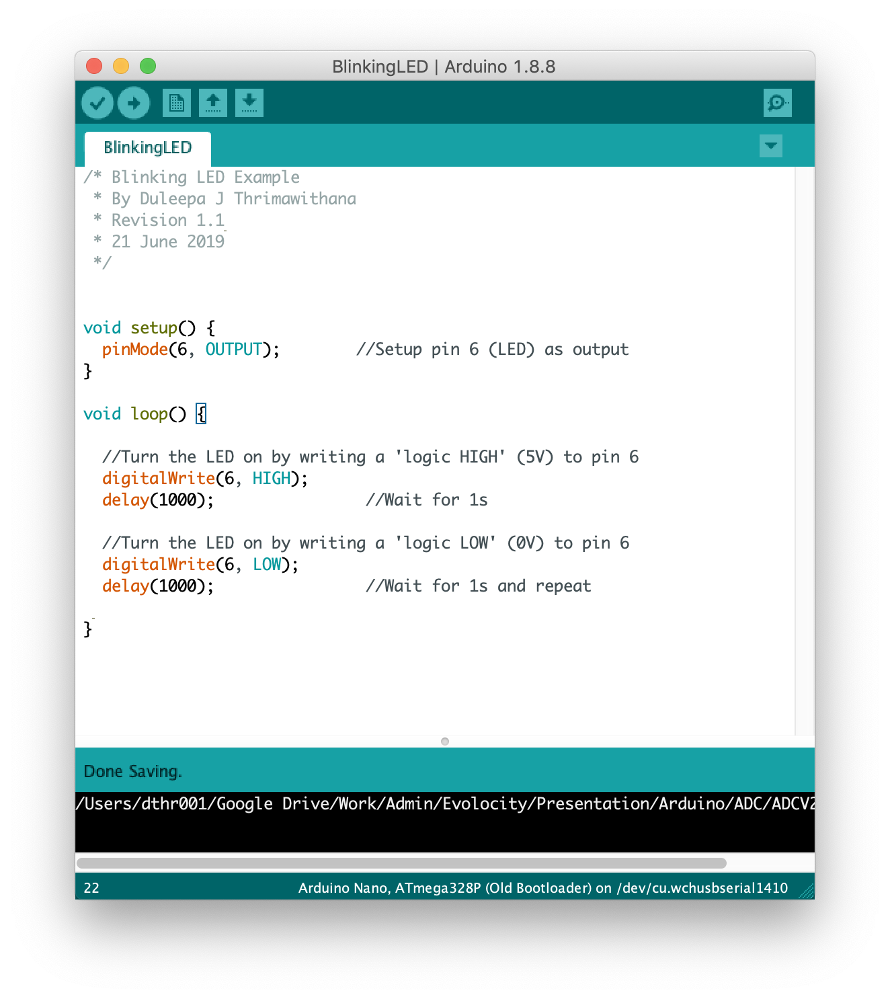

--------
# Digital and Analogue Inputs 

--------
#### Reading Inputs
### Digital Input Signals

- Binary signals that correspond to a logic high (true) or logic low (false) 
  - A logic high is (usually) 5V and a logic low is 0V
  - Digital signals are read using a digital pin
  - Need to setup the pin as an 'input' pin
      
________
#### Reading Inputs
### Analogue Input Signals

- Continuous voltage signals that change over time 
  - Read using an Analogue to Digital converter (ADC)
  - Microcontrollers typically have built in ADCs
  - Analogue siganls are read through specific ADC pins

________    
#### Reading Inputs
### Storing Inputs in a Variable

- Variables act as memory to store values, similar to math
- There are different variable types 
  - Integer, character, float, string, unsigned int, etc.
- Crucial to define the correct type of variable
  - Variables 'A' and 'B' that hold an integer number can be defined as *int A* and *int B*
  - 'A' can be assigned a value as *A = 2xB* or *A=10*
    
--------
# Digital Input Example
      
--------
#### Reading a Digital Input
### Detecting Push-Button Press 

- We can use a push-button to control an input signal
  - When pressed it connects 5V, which is a logic High
  - When released it has 0V, which is a logic Low
- Note: some circuits may use reverse logic ('active low')
- Write a program to light up an LED when the push-button is pressed 

________    
#### Reading a Digital Input
### Setting up the Breadboard 

- Modify the breadboard to connect push-button to pin 12
  - You may use a resistor and a capacitor as a debouncer

________    
#### Reading a Digital Input
### Push-Button Controlled LED 

- Setup pin 12 to read a logic signal (input)     
- Loop indefinitely while monitoring the digital pin
  - Store input in an integer variable 'switchInput'
  - Output 'switchInput' to pin 11, which is connected to LED
  
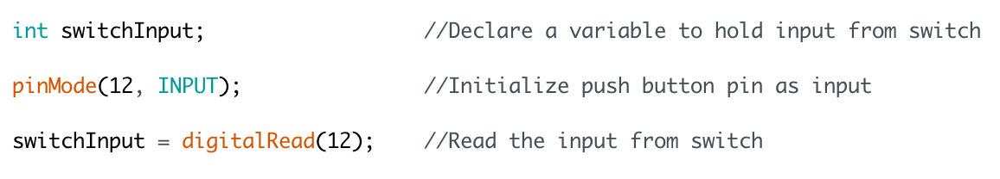

________    
#### Reading a Digital Input
### Final Program 

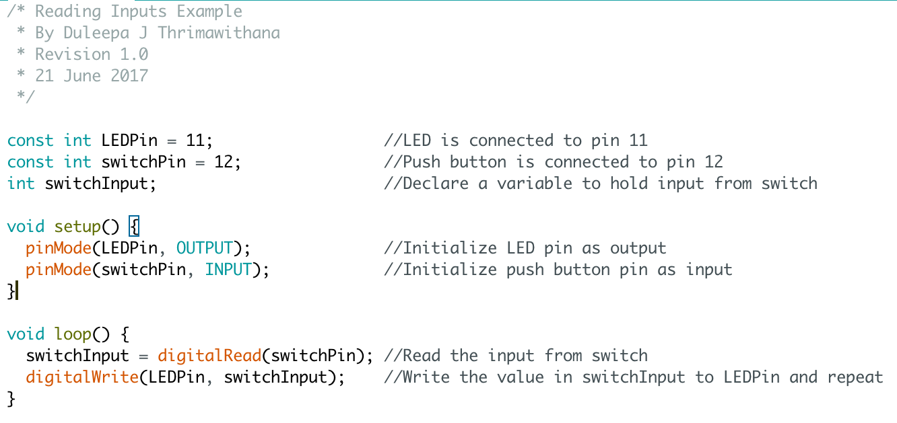

--------
# Decision Making Example
      
________    
#### Conditionals
### *IF* and *ELSE* Statements

- *if* and *else* statements can be used to make decisions
- Logic operators compare variables
  - Equal (A==B), not equal (A!=B)
  - Greater than (A>B), Less than (A<B)
  - AND (A&&B), OR (A||B)

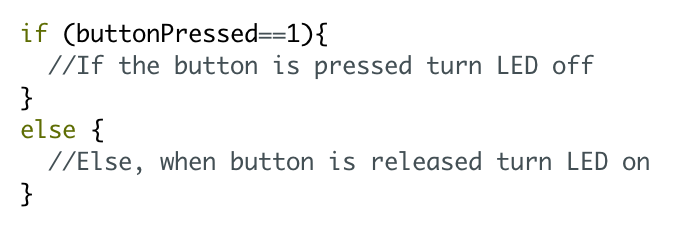

________    
#### Conditionals
### Toggle LED with Button Press

- Use an if statement to check if the digital input pin attached to the button is logic-high
- If logic-high, then change state of the LED
  - We need to set a *flag* to make sure LED is not toggled until the next press
  - We don't toggle the LED if the *flag* is high
- Else, reset the *flag* if the button is released

________    
#### Conditionals
### Final Code

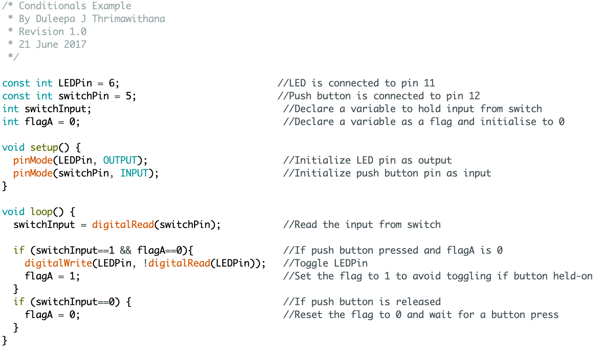

--------
# 9V Battery Voltage Measurement Example
      
--------
#### Measuring Battery Voltage
### Breadboard the Voltage Sensor

- Connect 9V battery
- Setup voltage divider to stepdown to 4.5V
- Wire sensed voltage to pin 0 (ADC0)
 
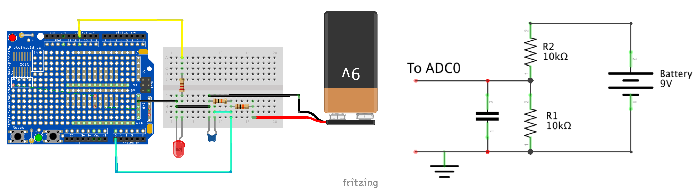
 
________    
#### Measuring Battery Voltage
### Setup ADC and Read Input

- Setup 2 variables to store measured analog value and actual voltage
- Read analog voltage at pin 0 and store ADC0 reading 
- Convert to actual voltage and store in second variable
  - Multiply by (1/step-down ratio) x (5/1023)
    
________    
#### Measuring Battery voltage
### Battery Low LED

- Modify program to light up LED if the battery less than 10V
  - Tell program to also setup pin 11 to output
  - If voltage is less than 8.5V write a logic-high to pin 11

________    
#### Measuring Battery Voltage
### Final Code

--------
# Optical Tachometer Example
      
--------
#### Tachometer Example
### Breadboarding the Photo Interrupter

- Wire the infrared (IR) LED and receiver on the breadboard
  - Supply 5V to IR LED through a current limiting resistor
  - Connect the output of the IR receiver to pin 11

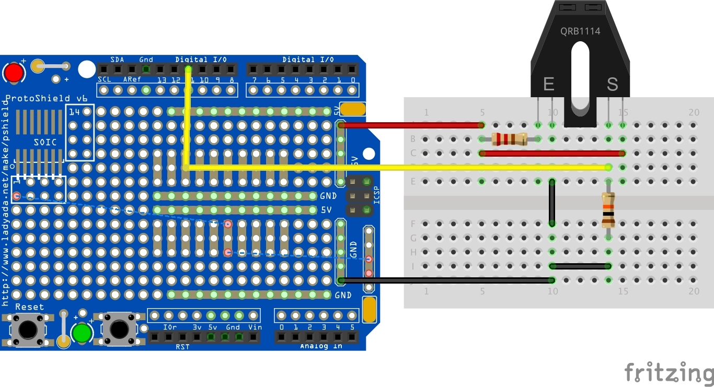
 
________   
#### Tachometer Example
### Measuring Speed

- Setup pin 11 to be an input
- Wait for logic-high and measure the duration of the logic-high signal
  - Length of the logic-high is proportional to the speed

________    
#### Tachometer Example
### Final Code

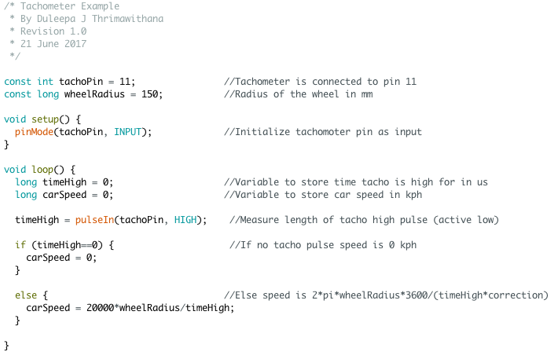

--------
# Wireless Communication Example
      
--------
#### Data Transfer
### Communication Protocols

- Microcontrollers communicate with other devices through many methods
  - Examples include USB, serial, CAN, etc.
- *Serial* provides a simple way to send/revieve messages
  - Send/receive a stream of logic-highs and logic-lows over a single wire 
    
________   
#### Data Transfer
### Serial Communication

- Setup serial to transmit data at a speed of 9600 bps
- Use print function to send + display your name on the PC
    - Use Arduino serial monitor to recieve message on the PC

________   
#### Data Transfer
### Bluetooth Communication

- Most Bluetooth modules can communicate with the microcontroller using serial 
- Wire the Bluetooth module on the breadboard
    - Supply 5V, GND and connect serial pins
- Use print function to send and display your name on your smartphone

________    
#### Data Transfer
### Final Code

--------
### References

[Arduino Language](https://www.arduino.cc/en/Reference/HomePage)
[Arduino Simulators](https://www.smashingrobotics.com/arduino-simulators-lineup-start-developing-without-real-board/)

--------
### Credit

This presentation has been prepared by the following team from the Electrical & Computer Engineering Department at The University of Auckland.

[Duleepa J Thrimawithana](https://unidirectory.auckland.ac.nz/profile/d-thrimawithana), [Andrew Chen](https://www.andrewchen.nz), [Ryan Kurte](https://ryan.kurte.nz/),   [Wai Yeung](https://www.ece.auckland.ac.nz/people/w-yeung) and [Kevin Wang](https://unidirectory.auckland.ac.nz/profile/kevin-wang)
